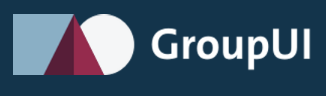

# Hey! 👋🏼 I'm Tim Gesemann

I'm a fullstack developer, with a passion for frontend, design systems and infrastructure development. I'm currently located in Hanover, Germany working for the Volkswagen Group.

<a href="https://www.linkedin.com/in/tim-gesemann/" target="_blank"></a>
<a href="https://www.instagram.com/_nnameseg/" target="_blank"></a>
<a href="https://twitter.com/geezy_tim" target="_blank">
</a>

## 👨🏻 About me

```typescript

const tim = {
  profession: 'developer',
  field: 'fullstack'
  favoriteLanguages: ['typescript', 'html', 'css']
  favoriteTopics: ['frontend', 'infrastructure', 'dev-ops']
  favoriteTechnologies: [
    'React',
    'SvelteKit',
    'AWS CDK',
    'Github Actions'
    'MongoDB',
    'PostgreSQL'
  ],
  currentEmployer: 'Volkswagen Group',
  currentLocation: 'Hanover, Germany',
  age: 27,
  hobbies: [
    'friends',
    'hiking',
    'handball',
    'gaming',
    'coding'
  ],
  website: 'https://tim-gesemann.dev'
}
```

Click [here](https://tim-gesemann.dev). Just do it 😬

## 💻 My current project

<div align="center">

<a href="https://www.red-dot.org/de/project/groupui-41315"></a>

</div>

<strong>GroupUI</strong> is the design system of the Volkswagen Group. It utilizes <strong>design tokens</strong> to provide ready to use `React`, `Angular` & `web-components` for internal & external projects.

## 🗂️ Check out these projects!

<div align="center">

[](https://github.com/timges/serverless-twitter-bot)
[](https://github.com/timges/personal-homepage)

</div>

## 📈 Stats & Facts. Whatever that means

<div align="center">


</div>

## 🏆 Congrats, you made it to the end! You earned yourself a bad joke

<div align="center">

<a href="https://readme-jokes.vercel.app"></a>

</div>
